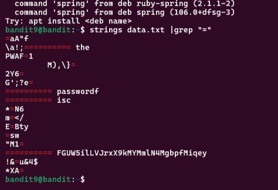
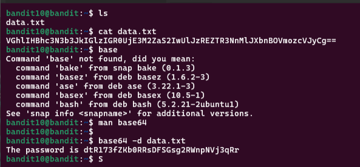

# OverTheWire Bandit Solutions

## Level 0
- **Commands Used:**
  ```bash
  ssh bandit0@bandit.labs.overthewire.org -p 2220
  ```
- **Password Found:** bandit0


## Level 1
- **Commands Used:**
  ```bash
  ls
  cat readme
  ```
- **Password Found:** ZjLjTmM6FvvyRnrb2rfNWOZOTa6ip5If


## Level 2
- **Commands Used:**
  ```bash
  ls -alps
  cat ./-
  ```
- **Password Found:** 263JGJPfgU6LtdEvgfWU1XP5yac29mFx


## Level 3
- **Commands Used:**
  ```bash
  cat spaces\ in\ this\ filename
  ```
- **Password Found:** MNk8KNH3Usiio41PRUEoDFPqfxLPlSmx


## Level 4
- **Commands Used:**
  ```bash
  ls -alps
  cat ...Hiding-From-You
  ```
- **Password Found:** 2WmrDFRmJIq3IPxneAaMGhap0pFhF3NJ


## Level 5
- **Commands Used:**
  ```bash
  ls
  find . -type f |xargs file
  cat ./file07
  ```
- **Password Found:** 4oQYVPkxZOOEOO5pTW81FB8j8lxXGUQw


## Level 6
- **Commands Used:**
  ```bash
  find . -type f -size 1033c ! -executable
  cat readme
  ```
- **Password Found:** HWasnPhtq9AVKe0dmk45nxy20cvUa6EG


## Level 7
- **Commands Used:**
  ```bash
  find / -size 33c -user bandit7 -group bandit6
  cat /var/lib/dpkg/info/bandit7.password 
  ```
- **Password Found:** morbNTDkSW6jIlUc0ymOdMaLnOlFVAaj


## Level 8
- **Commands Used:**
  ```bash
  ls
  cat data.txt
  strings data.txt | grep "millionth"
  ```
- **Password Found:** dfwvzFQi4mU0wfNbFOe9RoWskMLg7eEc


## Level 9
- **Commands Used:**
  ```bash
  ls
  cat data.txt
  sort data.txt | uniq -c
  ```
- **Password Found:** 4CKMh1JI91bUIZZPXDqGanal4xvAg0JM


## Level 10
- **Commands Used:**
  ```bash
  strings data.txt |grep "="
  ```
- **Password Found:** FGUW5ilLVJrxX9kMYMmlN4MgbpfMiqey




## Level 11
- **Commands Used:**
  ```bash
  ls
  base64 -d data.txt
  ```
- **Password Found:** dtR173fZKb0RRsDFSGsg2RWnpNVj3qRr



## Level 12
- **Commands Used:**
  ```bash
  ls
  strings data.txt
  strings data.txt | tr "$(echo -n {A..Z} {a..z} | tr -d ' ')" "$(echo -n {N..Z} {A..M} {n..z} {a..m} | tr -d ' ')"
  ```
- **Password Found:** 7x16WNeHIi5YkIhWsfFIqoognUTyj9Q4


