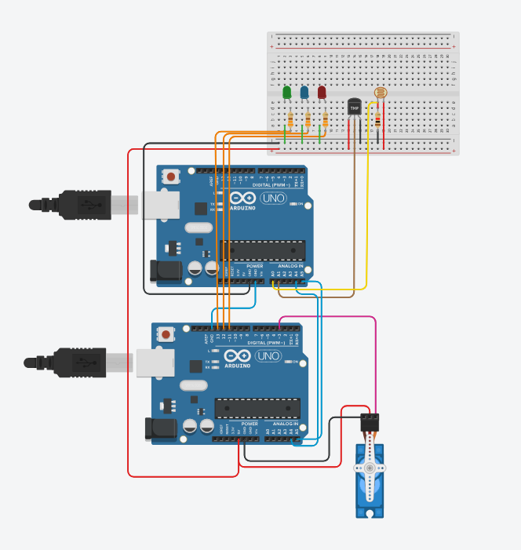

# Slave Code
The slave code is quite simple all its function is to get sensor reading from temeperature sensor and light sensor using analogRead function and then divide the reading by 4 to scale the data down from 1023 for peak value to 255 to be able to be sent as a byte then it sends the readings to the master when the data is requested according to a flag that is toggled after every data transmission and thsi flag's role is to select which sensor reading will be transmiited and this makes a different sensor to send it data each time.
# Master Code
The master code requests data from the slave and multiplies it by 4 to calculate the data originl value then converts the reading to a value to be understood (celsius for t sensor and for light sensor it scales value from 0 to 3.3 volts whihc is the maximum output of the photoresistor)

The calculated values are then used to control indicator leds making all leds on when the temeperature is too hot and moves servo to 3 different positions to close shutters when light intensity is high.

# Circuit

